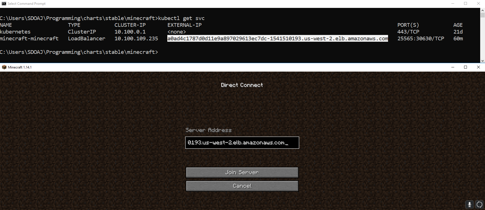
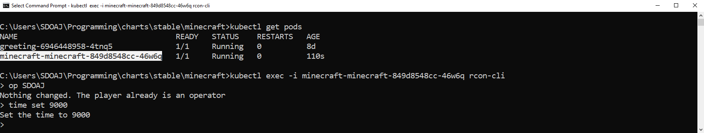

# helm-minecraft

Instructions on how to run a Minecraft server using Kubernetes.

## Goals

- Run a Minecraft server that anyone can connect to
- Persist the state (world, player data, etc.) across server crashes/reinstalls

## Instructions

1. Obtain access to a EKS cluster (instructions at http://arun-gupta.github.io/add-iam-user-to-eks/)
2. Install Helm on the EKS cluster (follow instructions at http://arun-gupta.github.io/helm-eks/) 	
3. Download the Helm chart (https://github.com/AdityaGupta1/charts/tree/master/stable/minecraft)
    - This chart has a few important differences from the one at https://github.com/helm/charts/tree/master/stable/minecraft:
        - Custom PV and PVC which point to a pre-created EBS volume
        - Batch/shell scripts to easily install/uninstall the chart 
4. Set the volume ID in `ebs-pv.yaml`
    - Both the PV and PVC have the storage class `manual` - if the strorage class was not explicitly stated in both, an storage class mismatch error prevented access to the PV
5. Run `install-server.bat` or `install-server.sh` depending on which OS you are using
6. Find the external IP of the `minecraft-minecraft` service and connect to that IP in Minecraft

    - Use `kubectl exec -i <pod name> rcon-cli` to access the server console

7. Enjoy your **epic** Minecraft server
